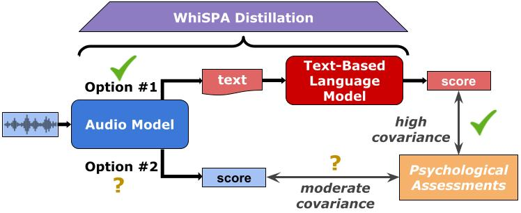
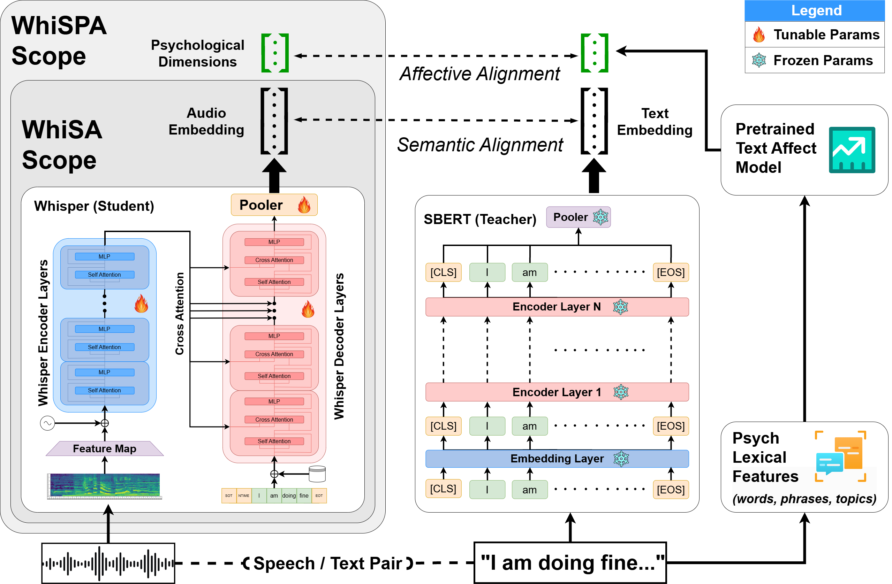

# WhiSPA: Whisper Semantically and Psychologically Aligned



This is the code repository for the [WhiSPA paper](https://arxiv.org/abs/2501.16344).

## Table of Contents

1. [Introduction](#intro)
2. [Environment Setup](#env)
3. [Pretraining WhiSPA](#pretrain)
4. [Inference](#inference)

<a id="intro"></a>

## Introduction

WhiSPA (Whisper with Semantic-Psychological Alignment) is a novel speech encoder that leverages the Whisper model as a backbone and aligns its audio embeddings with text representations from SBERT and psychological embeddings. This alignment is achieved through a contrastive student-teacher learning objective, using hundreds of thousands of audio segments from mental health interviews. WhiSPA aims to capture both semantic and psychological information in audio-only encoder models, surpassing state-of-the-art speech models in various tasks.

<a id="env"></a>

## Environment Setup

To set up the environment for WhiSPA, you can use the provided `environment.yml` file to create a conda environment. Run the following command:

```bash
conda env create -f environment.yml
conda activate speech
```

<a id="pretrain"></a>

## Pretraining WhiSPA

```bash
python pretrain/whispa_train.py \
--whisper_model_id openai/whisper-tiny \
--with_bidirectionality \
--loss CS \
--num_epochs 50 \
--batch_size 700 \
--num_workers 16 \
--lr 1e-5 \
--wd 1e-2 \
--save_name <MODEL_SAVE_NAME>
```

### Training Procedure



WhiSPA is trained using a student-teacher contrastive alignment approach. The Whisper model (student) is aligned with SBERT and psychological embeddings (teacher) to increase the cosine similarity between their embeddings. This alignment helps WhiSPA capture both semantic and psychological information in the audio embeddings.

<a id="inference"></a>

## Inference

We have pushed our pretrained model to HuggingFace with the `model_id` [Jarhatz/whispa_394_v1](https://huggingface.co/Jarhatz/whispa_394_v1). You can run inference on a directory of audio files or a singular audio file using our audio encoder script.

```bash
python inference/encode_audio.py \
--model_id Jarhatz/whispa_394_v1 \
--hf_token $HUGGINGFACE_HUB_TOKEN \
--audio_path <AUDIO_FILE_PATH or AUDIO_DIR_PATH> \
--output_path <OUTPUT_DIR_PATH> \
--device cuda
```

_\*Note: .wav, .mp3, and .m4a are known to be supported with our pipeline._

## Citation
Please cite our work if you choose to use it. We appreciate it.
```bash
@misc{rao2025whispasemanticallypsychologicallyaligned,
      title={WhiSPA: Semantically and Psychologically Aligned Whisper with Self-Supervised Contrastive and Student-Teacher Learning}, 
      author={Rajath Rao and Adithya Ganesan and Oscar Kjell and Jonah Luby and Akshay Raghavan and Scott Feltman and Whitney Ringwald and Ryan L. Boyd and Benjamin Luft and Camilo Ruggero and Neville Ryant and Roman Kotov and H. Andrew Schwartz},
      year={2025},
      eprint={2501.16344},
      archivePrefix={arXiv},
      primaryClass={eess.AS},
      url={https://arxiv.org/abs/2501.16344}, 
}
```
